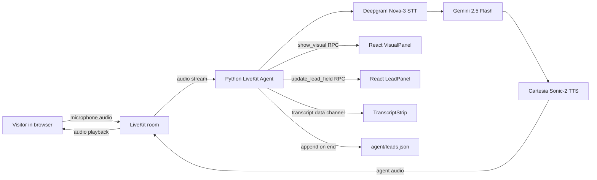

# Talk to Founder - Voice AI Agent for Maneuver

A real-time browser voice agent for Maneuver that runs a founder-style discovery call, answers questions about the company, updates a synchronized visual layer, and saves captured lead context to a local JSON file.

This repository is a submission for the Maneuver Voice AI intern assignment. It uses LiveKit Agents for the voice pipeline, React for the browser UI, and LiveKit RPC/data channels for real-time visual synchronization.

## What It Does

When a visitor opens the app, they can click **Start conversation**, grant microphone access, and speak with Alex, an AI founder-style representative for Maneuver.

The agent handles two modes in the same call:

- **Discovery mode:** asks natural founder-style questions about the visitor, company, problem, timeline, budget, and contact details.
- **Q&A mode:** answers questions about Maneuver's services, process, pricing model, team, and case studies from a local knowledge base.

The frontend reacts while the call is happening:

- service cards appear when the visitor asks about services
- case study cards appear when the visitor asks about examples or results
- process diagrams and service details render for more specific questions
- discovery notes populate live as the visitor speaks
- a transcript strip shows the conversation in-session
- captured lead data is saved to `maneuver-voice-agent/agent/leads.json` when the conversation ends

## Assignment Coverage

| Requirement | Implemented |
| --- | --- |
| Real-time voice in / voice out | LiveKit room with Python voice pipeline |
| LiveKit Agents framework | `livekit-agents` Python worker |
| STT -> LLM -> TTS pipeline | Deepgram Nova-3 -> Gemini 2.5 Flash -> Cartesia Sonic-2 |
| Turn detection | Silero VAD with low-latency silence settings |
| Interruptions | LiveKit voice pipeline with interruptible speech |
| Discovery mode | Founder-style system prompt plus deterministic lead extraction |
| Q&A mode | Local markdown knowledge base in `agent/knowledge_base.md` |
| Discovery persistence | Local append-only `agent/leads.json` |
| Browser frontend | React + Vite + LiveKit components |
| Synchronized visual layer | LiveKit RPC from agent to React visual panel |
| Live discovery notes | RPC updates to the frontend lead panel |
| Transcript view | LiveKit data-channel transcript strip |
| Agent state indicator | Listening / thinking / speaking UI |
| Demo readiness | Script and walkthrough in `maneuver-voice-agent/docs` |

## Tech Stack

| Layer | Choice | Why |
| --- | --- | --- |
| Realtime transport | LiveKit Cloud | Required by the assignment; handles WebRTC audio rooms and participant RPC |
| Agent framework | LiveKit Agents for Python | Direct support for STT/LLM/TTS pipelines, tool calls, VAD, room lifecycle, and worker dispatch |
| Speech-to-text | Deepgram Nova-3 | Fast streaming transcription, strong conversational accuracy, official LiveKit plugin |
| LLM | Gemini 2.5 Flash through OpenAI-compatible API | Low latency, good tool calling, practical free-tier development path |
| Optional local LLM | Ollama OpenAI-compatible endpoint | Useful fallback for local experimentation |
| Text-to-speech | Cartesia Sonic-2 | Low time-to-first-audio and natural real-time voice quality |
| Voice activity detection | Silero VAD | Local VAD, reliable turn boundaries, tunable silence duration |
| Frontend | React 18 + Vite | Fast local development and easy LiveKit integration |
| Styling | Tailwind CSS | Compact, consistent UI styling |
| Animation | Framer Motion | Smooth visual panel transitions and discovery note updates |
| Persistence | Local JSON file | Simple, inspectable output for the assignment deliverable |

## Repository Layout

```text
.
+-- README.md
+-- maneuver-voice-agent
    +-- agent
    |   +-- agent.py              # LiveKit voice pipeline and room event handlers
    |   +-- tools.py              # LLM tools, visual RPC, lead capture, persistence
    |   +-- token_server.py       # Local token endpoint for frontend room joins
    |   +-- main.py               # Worker entrypoint
    |   +-- knowledge_base.md     # Maneuver services, process, pricing, case studies
    |   +-- requirements.txt
    |   +-- leads.json            # Captured discovery output
    +-- frontend
    |   +-- src
    |   |   +-- App.jsx
    |   |   +-- components        # Voice UI, visual panel, notes, transcript
    |   |   +-- slides            # Services, process, service detail visuals
    |   |   +-- rpcPayload.js     # Shared frontend RPC parsing helpers
    |   |   +-- tokenUtils.js
    |   +-- package.json
    |   +-- vite.config.js
    +-- docs
        +-- architecture.md
        +-- workflows.md
        +-- api-and-data-contracts.md
        +-- demo-script.md
        +-- walkthrough-30-min.md
```

## Prerequisites

- Python 3.11+
- Node.js 20+
- ffmpeg available on PATH
- LiveKit Cloud project
- Deepgram API key
- Cartesia API key
- Google AI Studio API key

## Local Setup

Clone the repo and enter the project:

```bash
git clone <repo-url>
cd Talk-to-Founder-Voice-AI-Agent
```

Install Python dependencies:

```bash
cd maneuver-voice-agent/agent
pip install -r requirements.txt
copy .env.example .env
```

Fill `maneuver-voice-agent/agent/.env`:

```env
LIVEKIT_URL=wss://your-project.livekit.cloud
LIVEKIT_API_KEY=your_livekit_api_key
LIVEKIT_API_SECRET=your_livekit_api_secret
DEEPGRAM_API_KEY=your_deepgram_key
CARTESIA_API_KEY=your_cartesia_key
LLM_BACKEND=gemini
GOOGLE_AI_API_KEY=your_google_ai_studio_key
GEMINI_MODEL=gemini-2.5-flash
```

Install frontend dependencies:

```bash
cd ../frontend
npm install
```

Create `maneuver-voice-agent/frontend/.env`:

```env
VITE_LIVEKIT_URL=wss://your-project.livekit.cloud
VITE_TOKEN_SERVER_URL=http://localhost:8080
```

The browser does not need LiveKit API secrets. It requests a participant token from the local token server started by the Python agent.

## Running Locally

Start the Python agent and local token server:

```bash
cd maneuver-voice-agent/agent
python main.py dev
```

Start the frontend:

```bash
cd maneuver-voice-agent/frontend
npm run dev
```

Open:

```text
http://localhost:5173
```

Click **Start conversation**, allow microphone access, and speak naturally.

## How The System Works



The Python agent and browser join the same LiveKit room. The browser publishes microphone audio; the agent subscribes, transcribes, reasons, speaks back, and sends visual state updates to the frontend. Visuals are triggered both by LLM tools and by deterministic transcript handlers for reliability.

## Visual Layer

The visual layer is driven by LiveKit RPC:

- `show_visual` updates the main visual surface.
- `update_lead_field` updates the discovery notes panel.
- `call_ended` switches the UI into the final summary state.

Supported visuals:

- services overview
- individual service detail
- process diagram
- freight brokerage case study
- hospitality group case study
- industrial supplier case study
- call-ended lead summary

## Lead Capture

Captured fields:

- `name`
- `company`
- `role`
- `problem`
- `timeline`
- `budget`
- `contact_email`
- `notes`
- `timestamp`

Example `leads.json` entry:

```json
{
  "notes": "My name is Priya Sharma from BuildFast. | We need to automate customer support for our logistics clients. | We want something live in six weeks. | Project-based, maybe around $50k.",
  "name": "Priya Sharma",
  "company": "Buildfast",
  "problem": "We need to automate customer support for our logistics clients.",
  "timeline": "in six weeks",
  "budget": "$50k",
  "contact_email": "priya@buildfast.example",
  "timestamp": "2026-05-23T10:20:31.442921+00:00"
}
```
## Deeper Documentation

Detailed technical docs live in `maneuver-voice-agent/docs`:

- `architecture.md` - system design, component responsibilities, diagrams, tradeoffs
- `workflows.md` - runtime flows for startup, voice turns, visuals, discovery capture, persistence
- `api-and-data-contracts.md` - token endpoint, RPC payloads, data-channel messages, lead schema

## What I Would Build Next With One More Week

1. Add an authenticated founder/admin dashboard for browsing calls, leads, and transcripts.
2. Persist full transcripts and optionally attach LiveKit room recording URLs.
3. Replace full knowledge-base injection with embeddings retrieval once the KB grows.
4. Add a scheduling handoff agent for booking follow-up calls.
5. Trigger a Slack or email summary at the end of every qualified call.
6. Add automated tests for RPC payload contracts and lead extraction edge cases.
7. Move the local token server to a production FastAPI/Express backend with auth, rate limits, and deployment config.

## Known Limitations

- This is intentionally local-first; there is no deployed production backend.
- `leads.json` is a simple local persistence layer, not a database.
- Discovery extraction is optimized for demo reliability, not exhaustive CRM-grade parsing.
- The knowledge base is markdown-backed and small enough to inject directly.
- The transcript strip is in-session only.
- There is no authentication or admin UI in this submission.

