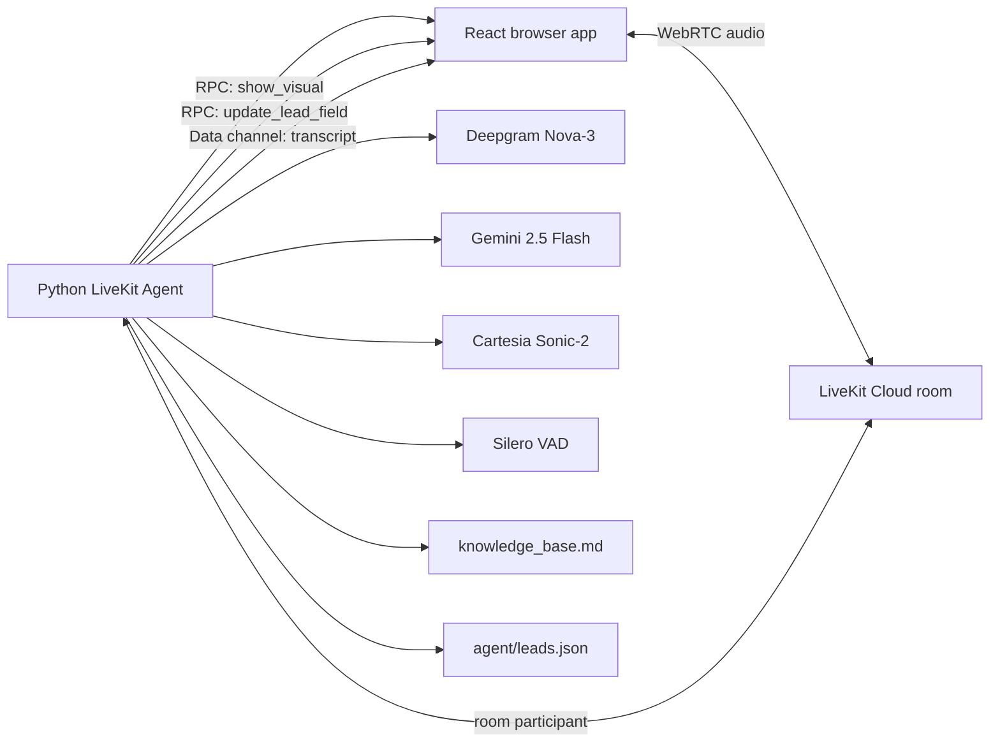
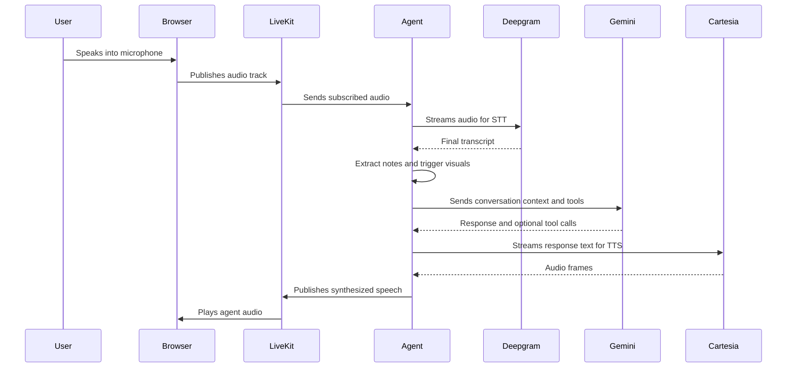
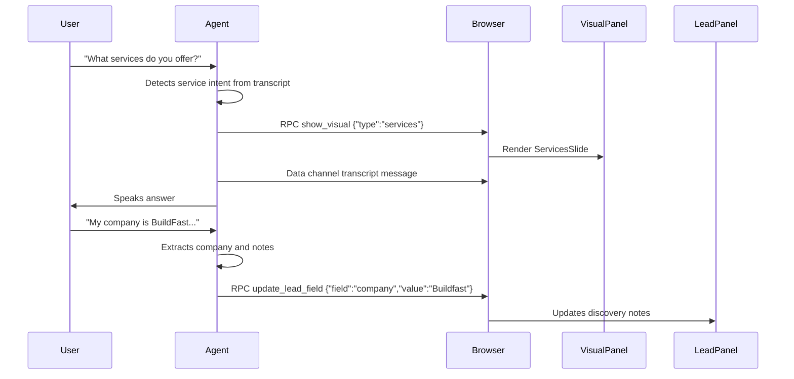

# Architecture

This document explains the complete system architecture for the Talk to Founder voice AI agent. It is written for a technical reviewer who wants to understand how the app works end to end, where state lives, how audio moves, how visuals are synchronized, and what tradeoffs were made.

## Design Goals

The assignment asks for a browser app where a visitor can have a real-time voice conversation with an AI founder representative. The system must support discovery, Q&A about Maneuver, lead capture, and ideally a synchronized visual layer.

The implementation optimizes for:

- low-latency voice turns
- simple local setup
- inspectable lead output
- visually obvious demo behavior
- clean separation between voice orchestration and React rendering
- reliable visual and note updates even when an LLM misses a tool call

## High-Level System



There are two runtime processes:

1. **Python agent process**
   - starts a local token server on port `8080`
   - registers a LiveKit worker named `maneuver-agent`
   - joins the room when dispatched
   - runs STT, LLM, TTS, VAD, tools, visual RPC, and lead persistence

2. **Vite frontend process**
   - serves the React app on port `5173`
   - requests a LiveKit participant token from the local token server
   - joins the same LiveKit room as the agent
   - renders voice controls, visuals, transcript, notes, and call-ended summary

## Component Responsibilities

### `agent/main.py`

Entrypoint for the LiveKit worker.

Responsibilities:

- load environment variables from `.env`
- start the local token server
- connect the worker to LiveKit
- instantiate `ManeuverAgent`
- keep the process alive until the room disconnects

### `agent/token_server.py`

Small local HTTP token server.

Endpoint:

```text
GET /api/token?roomName=<room>&participantName=<visitor>
```

Responsibilities:

- issue LiveKit participant JWTs
- include room join grants
- optionally include agent dispatch config for the `maneuver-agent` worker
- keep LiveKit API credentials out of browser environment variables

This is intentionally lightweight for local submission. In production it would become an authenticated backend route.

### `agent/agent.py`

Voice orchestration layer.

Responsibilities:

- build the system prompt with the local knowledge base
- configure Deepgram, Gemini, Cartesia, and Silero
- create the LiveKit `VoicePipelineAgent`
- register room lifecycle handlers
- register speech event handlers
- publish transcript messages over a LiveKit data channel
- warm the LLM connection to reduce first-turn latency
- save current lead state on disconnect
- register `end_conversation` RPC so the browser can ask the backend to save before disconnecting

Key reliability behavior:

- `user_speech_committed` triggers deterministic visual routing and lead extraction before relying on model tool calls.
- Chat history is trimmed before each LLM request to avoid unnecessary latency.
- VAD silence duration is tuned lower than the default for faster turn completion.

### `agent/tools.py`

Agent tool and state layer.

Responsibilities:

- define LLM-callable functions
- normalize and store lead fields
- forward visual updates to the frontend using LiveKit RPC
- append captured leads to `leads.json`
- keep a rolling `notes` field from committed user utterances
- detect service and case-study intent directly from user text
- retry frontend RPCs while the browser registers handlers

LLM-callable tools:

- `update_lead_field(field, value)`
- `update_lead_fields(updates)`
- `show_services_slide()`
- `show_service_detail(service_name)`
- `show_process_diagram()`
- `show_case_study(client_slug)`
- `save_lead_and_end()`

Deterministic helpers:

- `update_from_user_transcript(text, turn_index)`
- `trigger_visual_from_user_text(text)`

The deterministic helpers are important because demo-critical behavior should not depend only on whether an LLM chooses to call the correct function.

### `agent/knowledge_base.md`

Local markdown knowledge base containing:

- Maneuver positioning
- services
- process
- pricing model
- case studies
- team notes
- FAQ

This is injected into the system prompt because the file is small. If the KB grows, the next step is retrieval-augmented generation with embeddings.

### `frontend/src/App.jsx`

Top-level React shell.

Responsibilities:

- create random visitor identity and room name
- request LiveKit token from the token server
- mount `LiveKitRoom`
- manage call state
- register `call_ended` bridge
- reset stale demo/call state on new conversations

### `frontend/src/components/VoiceAgent.jsx`

Voice controls and end-call behavior.

Responsibilities:

- show listening/thinking/speaking state
- toggle microphone
- call backend `end_conversation` RPC before disconnecting

The explicit backend end RPC matters because a local browser disconnect alone may not give the agent enough time to persist the lead.

### `frontend/src/components/VisualPanel.jsx`

Main synchronized visual surface.

Responsibilities:

- register `show_visual` RPC
- route visual payloads to React slide components
- render idle state, services, process, service detail, case study, and call-ended summary
- animate transitions with Framer Motion

### `frontend/src/components/LeadPanel.jsx`

Live discovery notes.

Responsibilities:

- register `update_lead_field` RPC
- maintain local display state for captured fields
- animate field updates as they arrive

### `frontend/src/components/TranscriptStrip.jsx`

In-session transcript view.

Responsibilities:

- subscribe to LiveKit `lk-chat-topic` data messages
- render user and agent turns
- keep the user oriented during the demo

### `frontend/src/rpcPayload.js`

Shared RPC helper file.

Responsibilities:

- parse LiveKit RPC payloads whether they arrive as strings, byte arrays, or objects
- find the remote agent participant for browser-to-agent RPC calls

## Audio Pipeline



## Visual Synchronization



Visuals can be triggered in two ways:

1. **LLM tools**: Gemini can call `show_services_slide`, `show_case_study`, etc.
2. **Deterministic transcript handlers**: backend text matching triggers service/case-study visuals directly.

The second route exists because the assignment's demo expects immediate visuals. It makes key demo moments reliable even when LLM tool-calling behavior varies.

## Lead State Model

Lead state lives in memory during the call inside `ManeuverFunctionContext.current_lead`.

Fields:

- `name`
- `company`
- `role`
- `problem`
- `timeline`
- `budget`
- `contact_email`
- `notes`

When the call ends:

1. Browser calls `end_conversation` RPC, or the room disconnect handler runs.
2. The agent builds a lead object with `timestamp`.
3. The object is appended to `agent/leads.json`.
4. The frontend receives `call_ended` and renders a summary.

The save method skips timestamp-only records. That prevents empty output when a user ends immediately without providing discovery info.

## Latency Choices

The biggest perceived latency sources in a classic pipeline are:

- speech endpointing
- LLM first-token latency
- TTS time-to-first-audio
- network round trips

Current mitigations:

- Silero `min_silence_duration` is set to `0.35`
- the opening greeting delay is short
- the LLM connection is warmed when the room starts
- chat history is trimmed before LLM calls
- deterministic visual/lead updates happen immediately on committed transcript, not after the spoken response

## Tradeoffs

### Local JSON instead of database

This is enough for the assignment because the reviewer needs to inspect captured discovery output. A database would be better for multi-user production usage, but would add unnecessary setup friction.

### Direct markdown KB instead of vector retrieval

The knowledge base is small and stable. Prompt injection is simpler, faster to reason about, and sufficient here. Embeddings become useful once the KB grows or multiple client pages are added.

### Deterministic extraction plus LLM tools

The LLM is good at flexible conversations, but UI updates and saved lead output are demo-critical. Combining simple deterministic extraction with LLM tools gives a more reliable product experience.

### Local token server

The frontend does not store LiveKit secrets. The token server is local and minimal. A production version would add auth, rate limiting, logging, CORS restrictions, and deployment configuration.

## Failure Modes And Handling

| Failure | Current handling |
| --- | --- |
| Frontend RPC handler not ready | Backend retries RPC calls |
| User asks about services but LLM misses tool call | Deterministic transcript handler shows services slide |
| User ends from browser | Browser calls backend `end_conversation` RPC before disconnecting |
| Empty call ends | Save skips timestamp-only record |
| Token server port already used | Server logs failure and agent can still run if tokens are supplied another way |
| Agent participant misidentified | Frontend searches remote participants for agent/worker identity |
| LLM warmup fails | Warning is logged; normal LLM path still works |

## Production Hardening Plan

If this moved beyond a local assignment:

1. Replace local `leads.json` with Postgres.
2. Persist full transcript and room metadata.
3. Add auth to the token endpoint.
4. Add rate limiting and origin checks.
5. Add structured logging and tracing for turn latency.
6. Add tests around RPC contracts and lead extraction.
7. Add a founder/admin dashboard.
8. Add Slack/email summaries after qualified calls.
9. Add multi-agent scheduling handoff.
10. Deploy agent worker and frontend separately with environment-based config.
