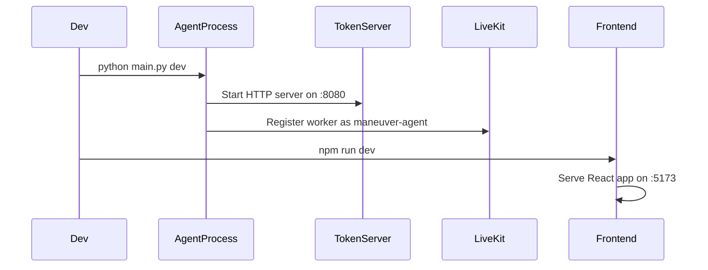
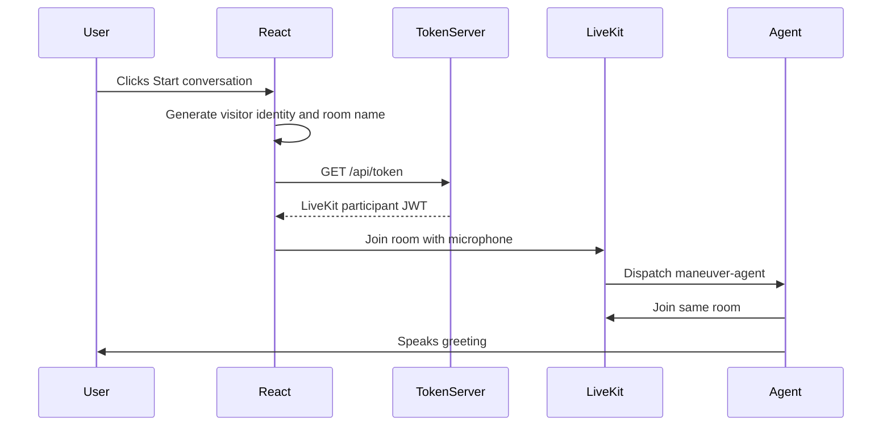
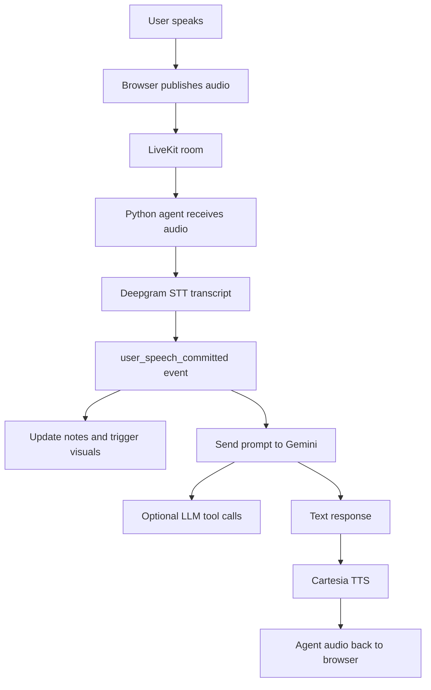
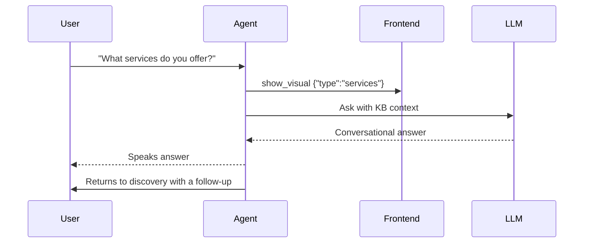
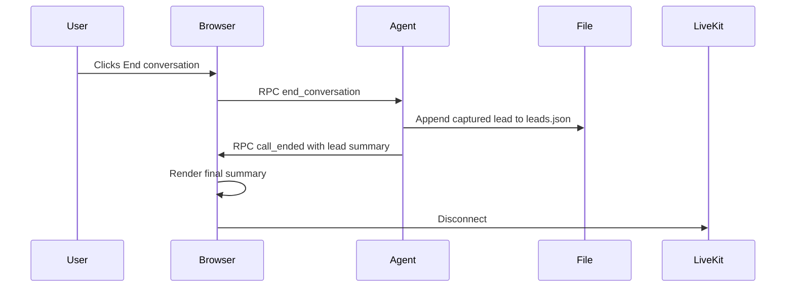

# Runtime Workflows

This document describes the important runtime flows in the Talk to Founder app.

## 1. Application Startup



The Python process does two jobs:

- starts the local token server
- runs the LiveKit agent worker

The frontend is a separate Vite dev server.

## 2. Starting A Conversation



The room name is randomized per conversation. This avoids stale participants and state collisions between demo runs.

## 3. Voice Turn



Important behavior:

- discovery notes update at `user_speech_committed`
- services/case-study visuals can appear before the agent finishes answering
- transcript messages are published as data-channel messages

## 4. Discovery Capture Workflow

Discovery capture has two layers.

### Layer 1: deterministic transcript capture

When a committed user transcript arrives, `tools.py`:

- appends the utterance to rolling `notes`
- looks for emails
- recognizes simple name/company patterns
- detects common role terms
- detects timeline phrases
- detects budget phrases
- stores problem-like utterances
- sends `update_lead_field` RPC updates to the frontend

This layer ensures the side panel and `leads.json` get useful information even if the LLM does not call a tool.

### Layer 2: LLM tools

The system prompt instructs the LLM to call:

- `update_lead_field(field, value)` for one field
- `update_lead_fields(updates)` for multiple fields learned in the same turn

This layer adds flexibility for phrasing that the deterministic layer may miss.

## 5. Q&A Mode Workflow



Q&A mode is not a separate agent. It is a behavior within the same voice agent:

- user asks about Maneuver
- agent answers from `knowledge_base.md`
- frontend shows a matching visual
- agent returns to discovery naturally

## 6. Visual Routing Workflow

Visual payloads are simple JSON contracts.

```json
{ "type": "services" }
```

```json
{ "type": "case_study", "client": "freight-brokerage" }
```

```json
{ "type": "service_detail", "service": "voice-ai" }
```

`VisualPanel.jsx` receives these over `show_visual` RPC and routes to the matching React component.

## 7. Ending A Conversation



The explicit `end_conversation` RPC prevents the most common failure mode: the browser disconnecting before the backend saves the lead.

## 8. Disconnect Safety Net

If the room disconnects without the browser calling `end_conversation`, the agent room disconnect handler calls `save_current_lead_if_needed`.

This saves the current lead if:

- there is captured lead data
- the lead has not already been saved

It skips empty leads to avoid timestamp-only entries.

